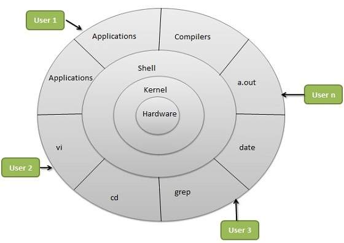

# Linux Introduction

## Linux Origins

* 1984: Proyek GNU dan Yayasan Perangkat Lunak Bebas
  * Membuat versi open source dari utilitas Unix
  * Membuat Lisensi Publik Umum (GPL)
* 1991: Linus Torvalds
  * Membuat open source, kernel mirip Unix, dirilis di bawah GPL
  * Port beberapa utilitas GNU, meminta bantuan online
* Hari ini:
  * Kernel Linux + Utilitas GNU = lengkap, open source, sistem operasi mirip Unix

***

## Linux Principles

* Semuanya adalah file (termasuk perangkat keras)
* Kecil, program tujuan tunggal
* Kemampuan untuk merangkai program bersama untuk melakukan tugas yang kompleks
* Hindari antarmuka pengguna yang tertahan
* Data konfigurasi disimpan dalam teks

***

## Why Linux?

* Sumber Terbuka.
* Dukungan masyarakat.
* Sangat dapat disesuaikan.
* Kebanyakan Server berjalan di Linux.
* DevOps sebagian besar alat hanya diimplementasikan di Linux.
* Otomasi
* Aman.

***

## Architecture of Linux

***

## Diffrent Linux distros

### Popular Desktop Linux OS

* Ubuntu Linux
* LinuxMint
* Lengkungan Linux
* Fedora
* Debian
* OpenSuse
### Popular Server Linux OS

* Red Hat Enterprise Linux
* Ubuntu Server
* Centos
* SUSE Enterprise Linux

### Most used Linux distros currently in IT industry

* RPM based:- RHEL & Centos
* Debian based :- Ubuntu Server

***

## Diffrence between RPM based and Debian based

Dari sudut pandang pengguna, tidak ada banyak perbedaan dalam kedua alat ini. Format RPM dan DEB keduanya hanyalah file arsip, dengan beberapa metadata yang terpasang di dalamnya. Keduanya sama-sama sulit dimengerti, memiliki jalur instalasi yang telah dikodekan dan hanya berbeda dalam detail halus. Berkas DEB adalah berkas instalasi untuk distribusi berbasis Debian. Berkas RPM adalah berkas instalasi untuk distribusi berbasis Red Hat. Ubuntu didasarkan pada manajemen paket Debian yang berbasis pada APT dan DPKG. Red Hat, CentOS, dan Fedora didasarkan pada sistem manajemen paket Red Hat Linux yang lama, yaitu RPM.

### DEB or .deb (Debian based softwares)

DEB adalah ekstensi dari format paket perangkat lunak Debian dan nama yang paling sering digunakan untuk paket biner tersebut. DEB dikembangkan oleh Bedian.

* **Example:** Google chrome software
* **Package name:** google-chrome-stable_current_amd64.deb
* **Installation:** `dpkg -i google-chrome-stable_current_amd64.deb`

### RPM or .rpm (Red Hat based softwares.)

Ini adalah sistem manajemen paket. Nama RPM mengacu pada format file .rpm, file dalam format ini, perangkat lunak yang dikemas dalam file tersebut, dan manajer paket itu sendiri. RPM ditujukan terutama untuk distribusi Linux; format file adalah format paket dasar dari Basis Standar Linux. RPM dikembangkan oleh Komunitas &
**Red Hat**.

* **Example:** Google chrome software
* **Package Name:** google-chrome-stable-57.0.2987.133-1.x86_64.rpm
* **Installation:** `rpm -ivh google-chrome-stable-57.0.2987.133-1.x86_64.rpm`

**Note:** Anda juga akan menemukan berbagai perintah, paket, dan nama layanan saat menggunakan kedua jenis distro tersebut

[Next: Terminal Basics](./Terminal%20Basics.md)
