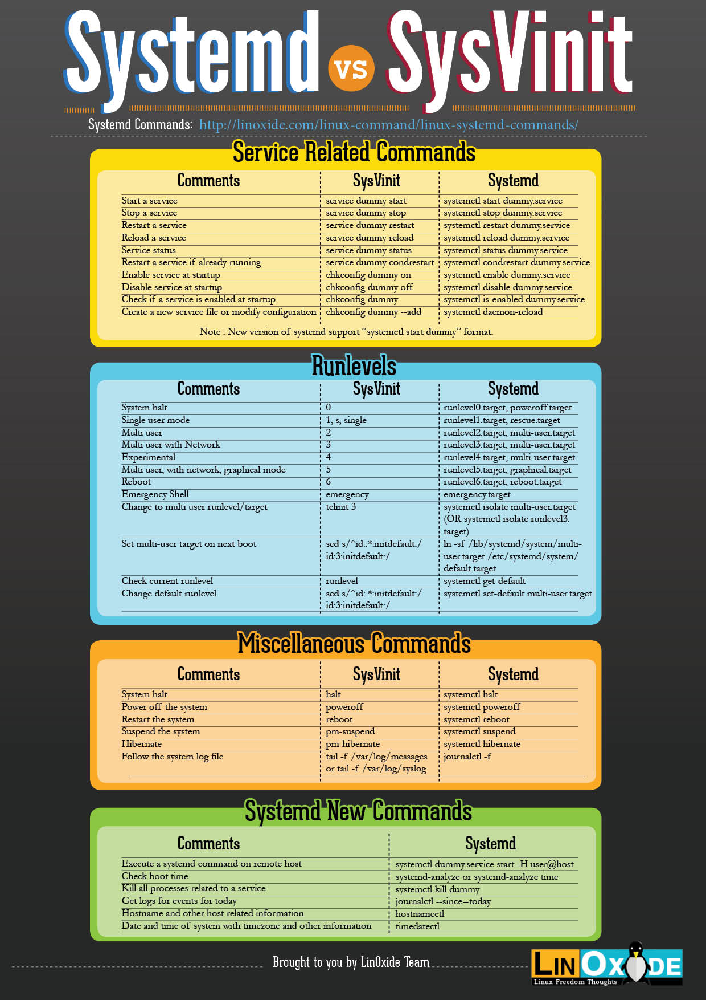

# Services

## Systemd vs Init

* **Systemd** adalah sistem init baru, dimulai dengan Fedora dan sekarang diadopsi di banyak distribusi seperti RedHat, Suse dan Centos. Secara historis, sebagian besar dari kita telah menggunakan skrip init SysV tradisional yang biasanya berada di /etc/rc.d/init.d/. Skrip ini memanggil biner daemon yang kemudian akan melakukan proses latar belakang. Meskipun skrip shell sangat fleksibel, tugas seperti mengawasi proses dan urutan eksekusi paralel sulit diterapkan. Dengan diperkenalkannya daemon gaya baru systemd, lebih mudah untuk mengawasi dan mengontrolnya saat runtime dan menyederhanakan implementasinya.

* The **systemctl** perintah adalah inisiatif yang sangat baik oleh tim systemd. Ini menunjukkan pesan kesalahan yang lebih rinci dan juga kesalahan runtime layanan termasuk kesalahan start-up. systemd telah memperkenalkan istilah baru yang disebut **cgroups** (grup kontrol) yang pada dasarnya adalah grup proses yang dapat diatur dalam hierarki. Dengan sistem init asli, menentukan proses mana yang melakukan apa dan milik siapa menjadi semakin sulit. Dengan systemd, ketika proses menelurkan proses lain, anak-anak ini secara otomatis menjadi anggota grup orang tua sehingga menghindari kebingungan tentang pewarisan.

* **Note:** `sudo reboot` system reboot
  after this action the package will be inactive and you need to active it.

[Next: Processes](./Processes.md)

[Prev: Archive](./Archive.md)
